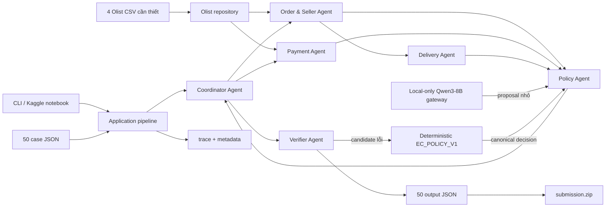

# Kiến trúc Multi-Agent E-commerce Dispute Resolution

## Mục tiêu

Hệ thống xử lý 50 khiếu nại Olist theo `EC_POLICY_V1`. Mã chạy chính nằm trong
package `src/multiagent_a2a`; notebook chỉ là runner mỏng cho Kaggle. Một backend
`Qwen/Qwen3-8B` dùng chung có thể đề xuất issue/cause/party, nhưng rule engine
xác định luôn là nguồn thẩm quyền cho tiền, evidence và quyết định cuối.

Không có code path tải model: gateway chỉ đọc model đã attach, một đường dẫn
`QWEN_MODEL_PATH`, hoặc snapshot đã có sẵn trong Hugging Face cache. Mọi lần gọi
`from_pretrained` bắt buộc `local_files_only=True`. Nếu model, dependency, CUDA,
VRAM, inference hoặc JSON có lỗi, hệ thống dùng deterministic fallback và vẫn
sinh đủ artifact nếu dữ liệu đầu vào hợp lệ.

## Sơ đồ thành phần



## Dependency direction

```text
constants + config + contracts + domain
                 ↓
        ports + data + llm + observability
                 ↓
               agents
                 ↓
       application pipeline
                 ↓
          CLI / notebook
```

Import package không đọc CSV, không load model, không cài package và không ghi
file. `run_pipeline()` là composition root duy nhất tạo repository, trace,
gateway và các agent cụ thể.

## Vai trò và quyền truy cập

| Thành phần | Được đọc | Không được quyết định | Handoff |
|---|---|---|---|
| Coordinator | Case và các handoff | Không tự truy vấn domain | Dispatch, tổng hợp, timing |
| Order & Seller | Orders, items, seller allowlist | Payment, policy, refund | Order status, item/seller, deadlines, item/freight totals |
| Payment | Payment rows và totals đã handoff | Delivery/root cause | Payment IDs, total, difference, reconciled |
| Delivery | Timestamp và shipping limits đã handoff | Refund/action | Late flag, violating sellers, completeness proof |
| Policy | Ba handoff và `EC_POLICY_V1` | Không tạo ID/evidence/tiền | Canonical decision và provenance |
| Qwen gateway | JSON handoff tối thiểu | Không ghi output | Proposal gồm đúng issue/cause/party |
| Verifier | Candidate, canonical và evidence allowlist | Không bỏ qua hard gate | Output hợp lệ hoặc canonical repair |

`OlistRepository` implement hai read-port riêng. Order Agent không có API đọc
payment và Payment Agent không có API đọc item/order. Items và payments luôn
được aggregate riêng để không nhân đôi tiền do join nhiều-nhiều.

## Luồng một case

1. Loader kiểm tra exact filename, `case_id`, `policy_version`, duplicate và order.
2. Order & Seller Agent dựng structured handoff, tính tiền bằng `Decimal`.
3. Payment Agent cộng từng `payment_value` đúng một lần và dùng tolerance 0.10 BRL.
4. Delivery Agent chỉ kết luận logistics on-time khi carrier timestamp và toàn bộ
   shipping limit đều tồn tại; timestamp thiếu không được suy thành đúng hạn.
5. Policy Agent tính canonical rule trước theo đúng priority. Qwen chỉ được đánh
   dấu `qwen_validated` khi proposal trùng canonical.
6. Verifier kiểm schema, enum, limits, tiền, status và evidence allowlist.
7. Pipeline ghi JSON nguyên tử, chạy golden QA, rồi mới publish ZIP, trace và metadata.

## Fallback và lỗi hard-fail

```text
local Qwen3-8B NF4 proposal
        │ unavailable / invalid / conflict
        ▼
deterministic EC_POLICY_V1 decision
        │ candidate output invalid
        ▼
Verifier canonical repair
```

Fallback chỉ áp dụng cho backend model. Input thiếu/sai, CSV sai schema, case nằm
ngoài coverage hoặc artifact không qua QA vẫn làm lượt chạy thất bại; những lỗi
này không được che bằng LLM fallback.

## Artifacts

- `output/EC_001.json` … `output/EC_050.json`: output đã verify.
- `trace.jsonl` và `logging/trace.jsonl`: đúng lượt chạy mới nhất, luôn overwrite.
- `metadata.json` và `logging/metadata.json`: configured/effective backend,
  offline policy, runtime và số case fallback.
- `submission.zip`: chỉ 50 JSON basename ở ZIP root.
- `individual_5SoCuoiMHV_HoVaTen.md`: giữ nguyên để người làm tự hoàn thiện.
