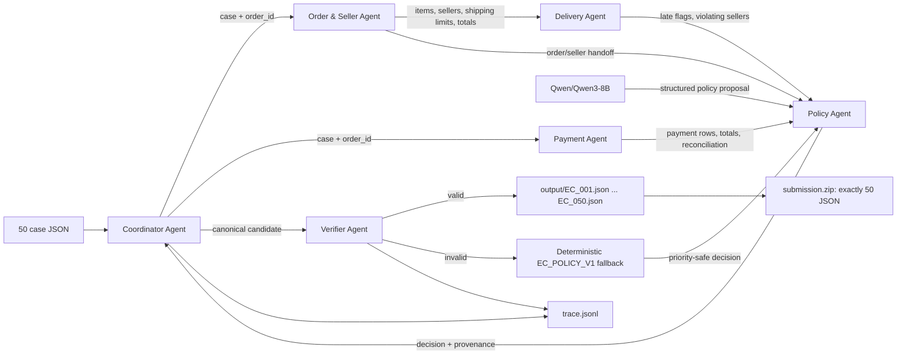

# Kiến trúc hệ thống Multi-Agent E-commerce Dispute Resolution

## Mục tiêu và nguyên tắc

Hệ thống xử lý 50 khiếu nại Olist theo `EC_POLICY_V1`. Toàn bộ mã nguồn chạy nằm trong notebook `multi_agent_ecommerce_dispute_qwen3.ipynb`. Một instance `Qwen/Qwen3-8B` (8.2B tham số) được dùng chung để đánh giá quyết định policy; các phép join, timestamp, tiền, entity và evidence được xử lý xác định để không cho mô hình phát sinh dữ kiện không tồn tại.

Nếu Qwen không tải được, hết VRAM, inference lỗi, trả JSON sai hoặc đề xuất mâu thuẫn với dữ liệu, Policy Agent tự động dùng rule engine. Verifier luôn là cổng bắt buộc trước khi ghi output.

## Sơ đồ agent và handoff



## Vai trò và quyền truy cập

| Agent | Được đọc | Không được quyết định | Handoff |
|---|---|---|---|
| Coordinator | Input case, các handoff | Không tự suy diễn dữ liệu domain | Điều phối, gom kết quả, ghi trace |
| Order & Seller | `olist_orders`, `olist_order_items`, danh mục seller | Payment, refund, policy cuối | Trạng thái order, item/seller IDs, shipping limit, item/freight totals |
| Payment | `olist_order_payments` và hai total đã handoff | Delivery/root cause | Payment IDs, số row, payment total, sai lệch và cờ reconciled |
| Delivery | Ba timestamp giao hàng và shipping limit đã handoff | Refund/action | Cờ giao trễ, seller bàn giao trễ, độ đầy đủ timestamp |
| Policy | Chỉ ba handoff có cấu trúc và `EC_POLICY_V1`; gọi Qwen | Không tạo ID hoặc số tiền mới | Issue, root cause, party, refund rule, action, nguồn quyết định |
| Verifier | Candidate, dữ liệu gốc tối thiểu và allowlist evidence | Không tin output Qwen nếu chưa đối chiếu | JSON đã xác minh hoặc bản dựng lại bằng fallback |

Tất cả bảng được lọc theo `claimed_order_id`. Items và payments được aggregate riêng trước khi đối chiếu, tránh nhân bản tiền do join nhiều-nhiều.

## Luồng xử lý một case

1. Coordinator kiểm tra `case_id`, `policy_version` và order tồn tại.
2. Order & Seller Agent dựng handoff về order/items/sellers và tính tiền bằng `Decimal`.
3. Payment Agent cộng từng `payment_value` đúng một lần rồi kiểm sai số `<= 0.10 BRL`.
4. Delivery Agent so timestamp trực tiếp theo CSV, với phép so sánh trễ là `actual > deadline`.
5. Policy Agent áp dụng đúng thứ tự ưu tiên. Qwen chỉ trả object nhỏ gồm issue/cause/party; proposal chỉ được nhận khi trùng quyết định xác định.
6. Coordinator dựng output canonical. Verifier kiểm schema, enum, giới hạn số phần tử, cross-field invariants, tiền và từng evidence ID.
7. Chỉ JSON đã qua Verifier mới được ghi. Trace ghi rõ agent, handoff, backend và lý do fallback.

## Chuỗi fallback

```text
Qwen NF4 4-bit từ model attach trên Kaggle
  -> Qwen NF4 4-bit từ cache/Hub
  -> FP16/BF16 sharded nếu tổng VRAM đủ
  -> EC_POLICY_V1 deterministic engine
  -> Verifier dựng lại canonical output nếu candidate không hợp lệ
```

Fallback không làm thay đổi facts đã kiểm chứng. `confidence` phản ánh độ chắc chắn của kết luận từ dữ liệu và rule, không phản ánh việc GPU/model có sẵn hay không; trạng thái model được lưu riêng trong trace và metadata.

## Artifacts

- `output/EC_001.json` ... `output/EC_050.json`: kết quả cuối.
- `trace.jsonl` và bản mirror `logging/trace.jsonl`: trace của đúng lượt chạy mới nhất, luôn overwrite.
- `metadata.json` và bản mirror `logging/metadata.json`: model khai báo, backend thực tế, framework, runtime và thống kê fallback.
- `submission.zip`: chỉ chứa 50 file JSON, không chứa source, log, `.gitkeep` hay secret.

Phần báo cáo `individual_5SoCuoiMHV_HoVaTen.md` được giữ nguyên để từng cá nhân tự hoàn thiện.
